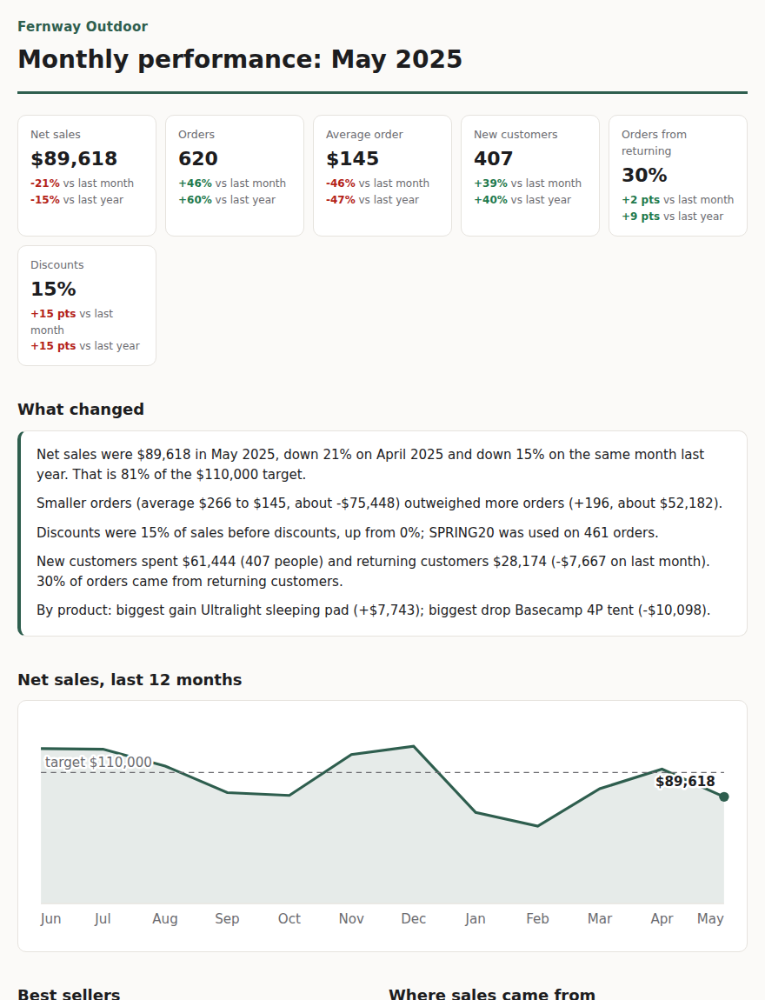

# RetainerKit

The monthly e-commerce report a freelance analyst delivers on retainer, templated per client.
One config file per client, their Shopify orders export in, a finished report out. DuckDB,
Jinja, inline SVG.

**Sample reports: [m4dd0ck.github.io/retainer-kit](https://m4dd0ck.github.io/retainer-kit/)**
(three months for a synthetic outdoor store; May is the interesting one)



## Why

Retainer work is the same report every month for every client. The value is in the reading, not
the assembling, so the assembling should take a minute: drop the new export in, run one command,
spend the time on what the numbers mean. Client two should take an hour to set up, not a week.

## Usage

Needs Python 3.12+ and [uv](https://github.com/astral-sh/uv).

```bash
uv sync
uv run retainer init clients/acme --name "Acme Goods"   # folder + starter client.toml
# put Shopify "Export orders" CSVs in clients/acme/exports/ (overlapping months are fine)
uv run retainer report clients/acme --month 2025-05     # -> clients/acme/reports/2025-05.html
```

`client.toml` holds everything that differs between clients:

```toml
name = "Acme Goods"
currency = "USD"
report_title = "Monthly performance"
brand_colour = "#2e5e4e"
monthly_sales_target = 50000       # optional
exclude_test_orders = true
test_order_emails = ["test@acme.example"]
```

`clients/` is gitignored: client exports hold customer emails and never belong in the repo.

Try it on the sample store: `uv run retainer demo` then
`uv run retainer report demo_clients/fernway --month 2025-05`.

## What's in the report

- **Headline figures**: net sales, orders, average order, new customers, share of orders from
  returning customers, discounts; each against last month and the same month last year (shares
  compared in percentage points).
- **What changed**: a few sentences written from the numbers. Sales change is split exactly into
  an orders effect and an order-value effect (they sum to the headline change), and when the two
  pull opposite ways the report says which won. Discounts are mentioned when their share moves,
  with the code behind it.
- **Trend, best sellers, markets**, and **cohorts**: how many first-time customers come back in
  the following months.
- **Footer**: how net sales and "new" are counted, the date range of the exports, and how many
  cancelled and test orders were left out, so any number can be checked against Shopify.

## Definitions

- **Net sales** = Subtotal (after discounts, before shipping and tax) minus Refunded Amount.
- **New customer** = first order in the exports provided. Older history is often not exported,
  so the report says so.
- Cancelled orders and orders from `test_order_emails` are excluded and counted.

## Shopify export quirks handled

- One row per line item, with order fields (email, totals, status) filled only on the first row
  of each order; orders are rebuilt from the non-blank values.
- The same order in two monthly exports: the newest file wins, since it carries later refunds.
- `Created at` like `2025-05-03 14:22:05 -0400`: the store's local date is used.

## Project structure

```
src/retainer_kit/
├── config.py      # client.toml
├── shopify.py     # export loading and cleaning
├── metrics.py     # monthly summary, customers, cohorts
├── drivers.py     # orders vs order-value split, product movers
├── narrative.py   # the what-changed sentences
├── charts.py      # inline SVG
├── report.py      # assembles the page
├── demo.py        # the sample store's exports
├── site.py        # sample reports for Pages
└── cli.py         # retainer init | report | demo | site
```

## License

MIT
